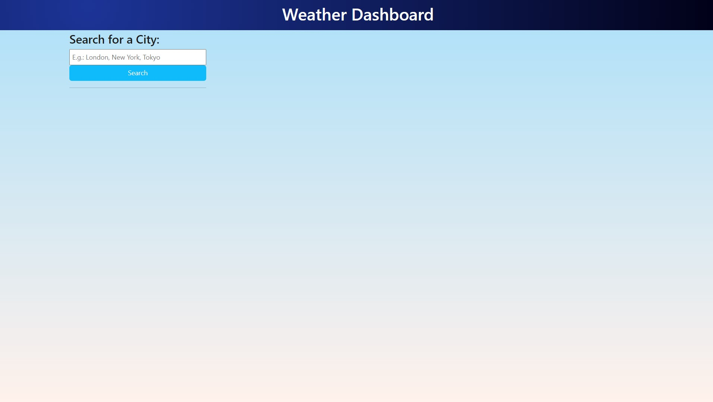
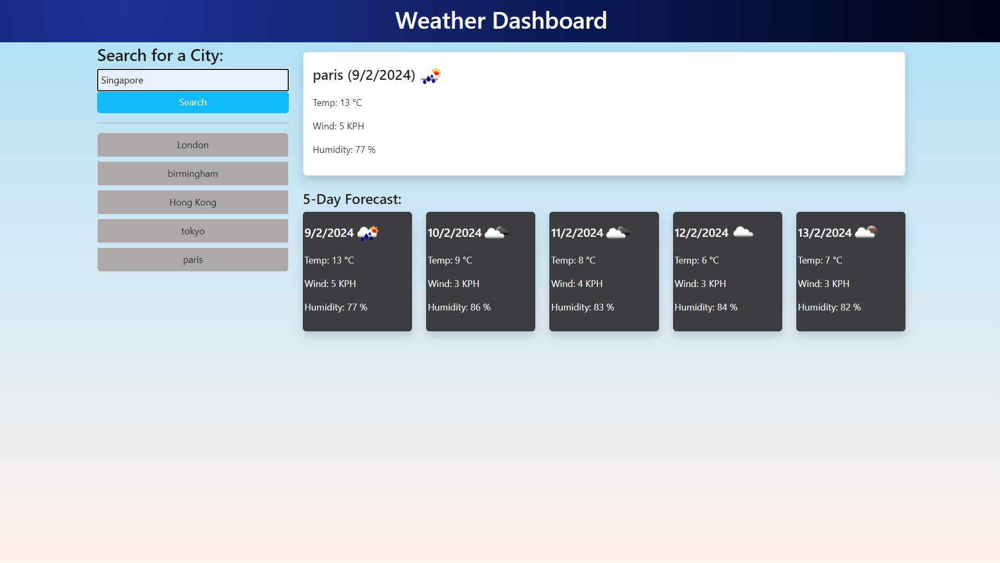

# Weather-Dashboard

Weather Dashboard

## User Story

AS A traveler
I WANT to see the weather outlook for multiple cities
SO THAT I can plan a trip accordingly

## Description

An application that provide each city weather information,
It shows that date & 5 days weather information,
Included City name, Date, Temperature, Wind speed, Humidity & An icon representation of weather conditions.

## Usage

Enter a city name and click "Search" button
The city today weather & 5 days forecast will appear in the right side
User search history will appear in the left bottom side
User can click search history city to check the weather again

## Screenshot

## Built with
- HTML
- CSS
- Java Script
- Day.js
- Bootstrap

## Setup
Please clone repo at: [git@github.com:Louie888A/Weather-Dashboard.git]

## License
[MIT](LICENSE)
